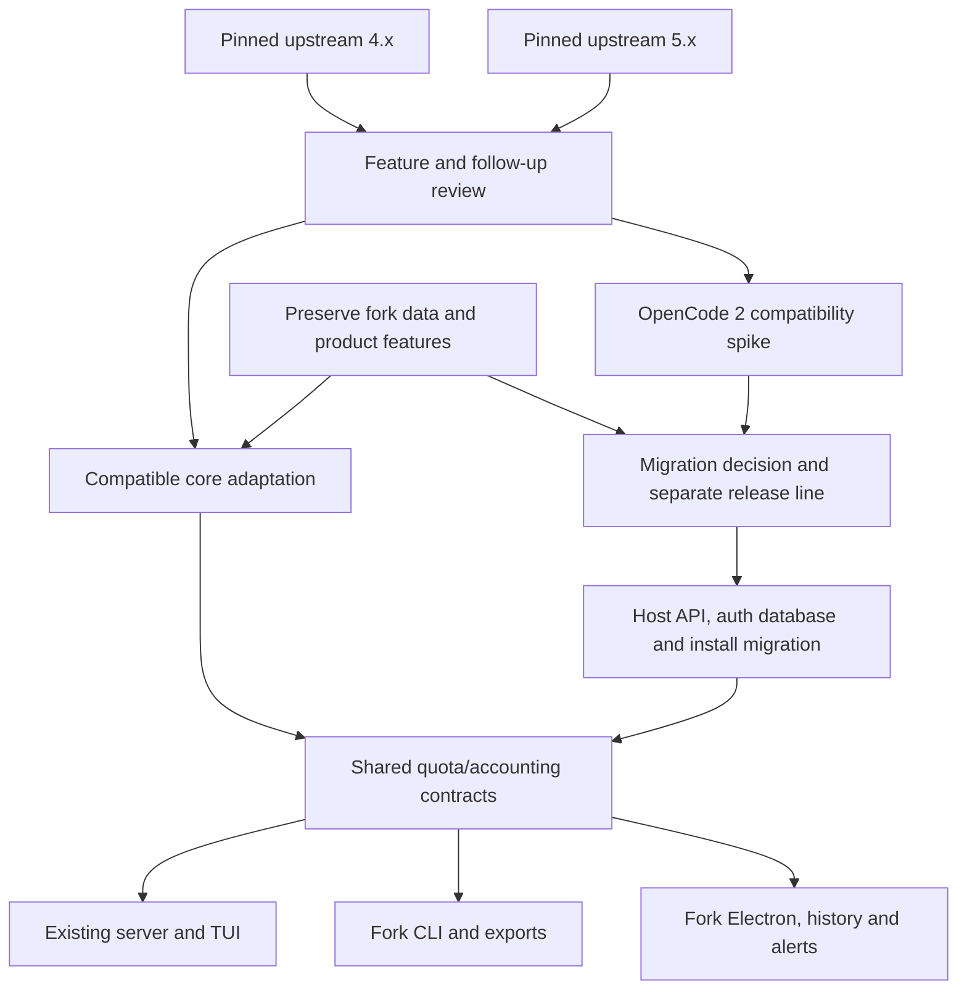

# Upstream feature adoption and migration map

Reviewed: 2026-10-08. This is the capability and provenance ledger for `slkiser/opencode-quota` → `thanhndv212/opencode-quota`. [UPSTREAM_DELIVERY_PLAN.md](UPSTREAM_DELIVERY_PLAN.md) remains authoritative for delivery status, issue dependencies, and release gates. Update both documents when an integration closes; this map adds source-to-target traceability rather than a second delivery schedule.

## Comparison boundary

| Line          | Pinned revision                                                                                                                       | Package / host contract                                                              | Role in this map                                                        |
| ------------- | ------------------------------------------------------------------------------------------------------------------------------------- | ------------------------------------------------------------------------------------ | ----------------------------------------------------------------------- |
| Fork main     | `ef00d42599ee918611304e8f12023b28917b6297`                                                                                            | `@thanhndv212/opencode-quota` 3.10.1; Node >=20; OpenCode 1 plugin dependency ^1.4.3 | Delivery baseline; actual host compatibility still requires measurement |
| Upstream 4.x  | [`2733b5bd010f659d1d6007e5d19026e82d51353f`](https://github.com/slkiser/opencode-quota/tree/2733b5bd010f659d1d6007e5d19026e82d51353f) | 4.10.8; legacy OpenCode integration                                                  | First source for compatible selective backports                         |
| Upstream main | [`0819759854fa65c68daf53296972e890f9ad3f5c`](https://github.com/slkiser/opencode-quota/tree/0819759854fa65c68daf53296972e890f9ad3f5c) | 5.0.2; upstream documents OpenCode >=2.0.16 and Node >=22.13 or >=23.4               | Feature reference plus separate host/auth migration                     |

The local agent commit `177f5fc` is a configuration-only addition in PR #37, outside this runtime comparison. Source snapshots were fetched and branch/release metadata checked on the review date. Versions identify source lines, not feature parity. This is a capability-level inventory, not an assertion that every upstream patch has been reviewed.

**Status meanings:** Adopted = merged with recorded acceptance evidence; Partial = some behavior delivered but an acceptance gate remains; Existing = fork implementation located, upstream equivalence unproven; Planned = linked delivery item, not delivered; In progress = accepted implementation under validation/review; Review = newly identified or unselected candidate; Deferred = requires a compatibility/product decision; Preserve = fork capability that must survive integration. No runtime tests were run for the initial documentation review; COR-03/05 delivery evidence is recorded separately below. Historical CI below is fixture/package evidence, not live provider or host certification.

## Routing map



A core feature can be adapted from 5.x without importing its host API. An upstream TUI implementation does not establish Electron support. All imports preserve deterministic commands, selected-account identity, trusted credential sources, and quota-only network requests.

## Capability ledger

| ID / capability                            | Upstream anchor or implementation                                                                                                                                                                                                                                                                                                                                                                                                                                                                                                                                                                                                  | Fork mapping and status                                                                                                                                                                               | Delivery / acceptance gate                                                                                                                                                                                                                                                                          |
| ------------------------------------------ | ---------------------------------------------------------------------------------------------------------------------------------------------------------------------------------------------------------------------------------------------------------------------------------------------------------------------------------------------------------------------------------------------------------------------------------------------------------------------------------------------------------------------------------------------------------------------------------------------------------------------------------- | ----------------------------------------------------------------------------------------------------------------------------------------------------------------------------------------------------- | --------------------------------------------------------------------------------------------------------------------------------------------------------------------------------------------------------------------------------------------------------------------------------------------------- |
| MAP-01 HTTP deadlines                      | [98b2aed](https://github.com/slkiser/opencode-quota/commit/98b2aedf205bfa278bc894be4e907a4cdea8cc49)                                                                                                                                                                                                                                                                                                                                                                                                                                                                                                                               | **Adopted**; `src/lib/http.ts` and provider/pricing callers; PR #32, main `99e0632`                                                                                                                   | COR-01 [#8](https://github.com/thanhndv212/opencode-quota/issues/8) closed; real local HTTP fixtures cover body stalls, abort and cleanup                                                                                                                                                           |
| MAP-02 Account-safe quota caches           | [0c2da89](https://github.com/slkiser/opencode-quota/commit/0c2da89a7244a0a174a3c28bf4bf187e25c1381e), [176f41c](https://github.com/slkiser/opencode-quota/commit/176f41cd0eb050ad01fb39519770d2f9bf387aae), [3ccd8f5](https://github.com/slkiser/opencode-quota/commit/3ccd8f56fbb2a2afb89312664a75dc1342436b12), [f2abe47](https://github.com/slkiser/opencode-quota/commit/f2abe4796b56d87b92f3a0579c9b8467686109b2)                                                                                                                                                                                                             | **Adopted with explicit limits**; `src/lib/quota-state.ts`, `resolved-auth-identity.ts`, `src/providers/account-cache.ts`; PR #35, main `3165abf`                                                     | COR-02 [#9](https://github.com/thanhndv212/opencode-quota/issues/9) closed; 13 resolved-auth adapters, 7 deliberately uncached; separate-process/restart evidence; see [cache audit](COR02_CACHE_DESIGN.md)                                                                                         |
| MAP-03 Error caching / recovery            | [fb14253](https://github.com/slkiser/opencode-quota/commit/fb142534f04a91c1b12f39ad39f89371269f7209)                                                                                                                                                                                                                                                                                                                                                                                                                                                                                                                               | **Adapted / Done**; error recovery in PR #34 and account-scoped cooldown in PR #38, `ef00d42`                                                                                                         | COR-03 [#10](https://github.com/thanhndv212/opencode-quota/issues/10); recovery and 429 cooldown delivered; main CI 37803649093 green on rerun; cooldown is process-local                                                                                                                           |
| MAP-04 Copied-session deduplication        | [ffdc82e](https://github.com/slkiser/opencode-quota/commit/ffdc82eec9e4bef3f1e25f5b2ebd03eb457f4b04) (4.x); [ee17665](https://github.com/slkiser/opencode-quota/commit/ee17665fa4fd982d5c22d5f4254e9db764c6cdd0) (main)                                                                                                                                                                                                                                                                                                                                                                                                            | **Adopted**; `src/lib/opencode-storage.ts`; PR #31, `26005c0`                                                                                                                                         | COR-04 [#11](https://github.com/thanhndv212/opencode-quota/issues/11) closed; copied records deduped while distinct events/sources remain separate                                                                                                                                                  |
| MAP-05 Copilot credits / over-limit        | [5d7d435](https://github.com/slkiser/opencode-quota/commit/5d7d435fb197722511ff1b5b456982dd55883d03), [5c65696](https://github.com/slkiser/opencode-quota/commit/5c65696302dc50b3153db7fd5546b219404703f2), [84c2a33](https://github.com/slkiser/opencode-quota/commit/84c2a330b9b741392dfbd4635f3f0e1dd4c9ce0f)                                                                                                                                                                                                                                                                                                                   | **In progress**; `fix/cor-05-provider-contracts` adapts credits, billing and over-limit contracts while retaining frozen auth queries; see [COR05_PROVIDER_CONTRACTS.md](COR05_PROVIDER_CONTRACTS.md) | COR-05 [#12](https://github.com/thanhndv212/opencode-quota/issues/12); legacy/new payloads, billing authorization, individual/business and >100% fixtures                                                                                                                                           |
| MAP-06 OpenAI windows / Anthropic cooldown | [3e845de](https://github.com/slkiser/opencode-quota/commit/3e845de9e7390d1c6d77e66f0ab2f45fc5615702); [c8241fc](https://github.com/slkiser/opencode-quota/commit/c8241fc0e0304cdacf9b21f4d8d3369055b57621)                                                                                                                                                                                                                                                                                                                                                                                                                         | **In progress / Partial**; OpenAI duration contracts under COR-05; Anthropic cooldown complete in PR #38                                                                                              | COR-05 [#12](https://github.com/thanhndv212/opencode-quota/issues/12) + COR-03 [#10](https://github.com/thanhndv212/opencode-quota/issues/10); exact duration, 401/429, re-auth then refresh                                                                                                        |
| MAP-07 Structured accounting               | [4c83628](https://github.com/slkiser/opencode-quota/commit/4c83628660a670ea1607988b2c9d581a59743f22), [95bc510](https://github.com/slkiser/opencode-quota/commit/95bc510e7e0a6184333dbfe460d6486984d7127b), [e24f825](https://github.com/slkiser/opencode-quota/commit/e24f82586c1f181051ae2f17c3399f29edcdb687), [d7aa2a8](https://github.com/slkiser/opencode-quota/commit/d7aa2a8ab26de24e614ced0d09949184e5ab0c93)                                                                                                                                                                                                             | **Planned**; replace/adapt display-only `QuotaToastEntry` through compatibility layer; consumers in plugin/TUI/CLI/GUI                                                                                | ACC-01 [#16](https://github.com/thanhndv212/opencode-quota/issues/16) → ACC-02 [#17](https://github.com/thanhndv212/opencode-quota/issues/17) → ACC-03 [#18](https://github.com/thanhndv212/opencode-quota/issues/18); units/currency/authority/unknowns, account/window identity, additive storage |
| MAP-08 Durable reset transitions           | [c2dca3c](https://github.com/slkiser/opencode-quota/commit/c2dca3c14904fef36712b682b28b54d9d7c149d0); [cedee73](https://github.com/slkiser/opencode-quota/commit/cedee73770bb11fb9fa860c2545899dd46782650); [src/lib/quota-reset-notifications.ts](https://github.com/slkiser/opencode-quota/blob/2733b5bd010f659d1d6007e5d19026e82d51353f/src/lib/quota-reset-notifications.ts)                                                                                                                                                                                                                                                   | **Planned**; new shared transition/dedup engine                                                                                                                                                       | INS-01 [#19](https://github.com/thanhndv212/opencode-quota/issues/19); depends on ACC-02; rollover, replenishment, concurrency and restart evidence                                                                                                                                                 |
| MAP-09 Reset notification delivery         | [src/lib/quota-reset-notifications.ts](https://github.com/slkiser/opencode-quota/blob/2733b5bd010f659d1d6007e5d19026e82d51353f/src/lib/quota-reset-notifications.ts)                                                                                                                                                                                                                                                                                                                                                                                                                                                               | **Planned**; plugin toast plus new Electron notification adapter; existing budget alerts are a different capability                                                                                   | INS-02 [#20](https://github.com/thanhndv212/opencode-quota/issues/20); after INS-01 + GUI-02; channel policy, OS permissions and observed delivery                                                                                                                                                  |
| MAP-10 Fixed-window exhaustion estimate    | [08dd8ea](https://github.com/slkiser/opencode-quota/commit/08dd8eadb0d29c48174e3971af2df51277e0ba0e); [src/lib/quota-exhaustion-projection.ts](https://github.com/slkiser/opencode-quota/blob/2733b5bd010f659d1d6007e5d19026e82d51353f/src/lib/quota-exhaustion-projection.ts)                                                                                                                                                                                                                                                                                                                                                     | **Planned**; shared computation + explicit CLI/TUI/Electron rendering                                                                                                                                 | INS-03 [#21](https://github.com/thanhndv212/opencode-quota/issues/21); after ACC-03; known fixed boundaries/full reset only, independent numerical fixtures, no extra fetch                                                                                                                         |
| MAP-11 Built-in provider expansion         | [src/providers/registry.ts](https://github.com/slkiser/opencode-quota/blob/2733b5bd010f659d1d6007e5d19026e82d51353f/src/providers/registry.ts)                                                                                                                                                                                                                                                                                                                                                                                                                                                                                     | **Planned / Review**; see provider matrix below                                                                                                                                                       | PRO-01 [#22](https://github.com/thanhndv212/opencode-quota/issues/22) OpenRouter after ACC-03 + COR-01; PRO-02 [#23](https://github.com/thanhndv212/opencode-quota/issues/23) selects later providers with auth, quota and surface evidence                                                         |
| MAP-12 Custom remote sources               | [8b005bc](https://github.com/slkiser/opencode-quota/commit/8b005bc557ba4dd7689c7c418f4c9ff5295289a6), [af3dfaf](https://github.com/slkiser/opencode-quota/commit/af3dfafd28ab1d1736bda7ec47907295394db413), [0d676d3](https://github.com/slkiser/opencode-quota/commit/0d676d3dccd72e68322c37d6b8250b6466e43aaa), [27ae978](https://github.com/slkiser/opencode-quota/commit/27ae978bb1e1dffed190e80a9a8a1b068ea2796f), [130d82b](https://github.com/slkiser/opencode-quota/commit/130d82b8c1b21c03a892a82817997c8181d7e887), [f6393b3](https://github.com/slkiser/opencode-quota/commit/f6393b3abb22beecd55b43da483acca6c496f8f6) | **Planned**; no `quotaProviders` engine in fork config; introduce bounded global-only schema/runtime                                                                                                  | CUS-01 [#24](https://github.com/thanhndv212/opencode-quota/issues/24); ACC-01 + COR-01/02; authenticated GET, safe redirects, bounded literal mappings, partial results                                                                                                                             |
| MAP-13 Durable local custom accounting     | [src/lib/quota-providers-local.ts](https://github.com/slkiser/opencode-quota/blob/2733b5bd010f659d1d6007e5d19026e82d51353f/src/lib/quota-providers-local.ts)                                                                                                                                                                                                                                                                                                                                                                                                                                                                       | **Planned**; preserve OpenCode and Claude Code source identities, integrate pricing overrides                                                                                                         | CUS-02 [#25](https://github.com/thanhndv212/opencode-quota/issues/25); CUS-01 + COR-04; coordinate account attribution with ACC-02; completion identity, retries, restart, missing prices                                                                                                           |
| MAP-14 Guided provider editor              | [src/bin/opencode-quota.ts](https://github.com/slkiser/opencode-quota/blob/2733b5bd010f659d1d6007e5d19026e82d51353f/src/bin/opencode-quota.ts)                                                                                                                                                                                                                                                                                                                                                                                                                                                                                     | **Planned**; existing `init` is not upstream `provider add`                                                                                                                                           | CUS-03 [#26](https://github.com/thanhndv212/opencode-quota/issues/26); CUS-01; local editor support follows CUS-02; JSONC preservation, idempotency, race detection, rollback                                                                                                                       |
| MAP-15 Passive OpenTelemetry               | [45abf19](https://github.com/slkiser/opencode-quota/commit/45abf196940d90102121f366384c26f52a63bbb7), [957459a](https://github.com/slkiser/opencode-quota/commit/957459aa5a82ec2acb3127eec407afccdf24ab5f), [227d963](https://github.com/slkiser/opencode-quota/commit/227d9639aec5f0f6be5d359032523478334d94e4), [c723058](https://github.com/slkiser/opencode-quota/commit/c7230586306ee79cd0af20be2c5711288849fb40)                                                                                                                                                                                                             | **Deferred / Optional**; fork has JSON/export, no quota meter adapter                                                                                                                                 | OBS-01 [#27](https://github.com/thanhndv212/opencode-quota/issues/27); ACC-01 + COR-02; host-owned meter only, cached observations, bounded labels                                                                                                                                                  |
| MAP-16 Deterministic reports and TUI       | [src/plugin.ts](https://github.com/slkiser/opencode-quota/blob/2733b5bd010f659d1d6007e5d19026e82d51353f/src/plugin.ts); [src/tui.tsx](https://github.com/slkiser/opencode-quota/blob/2733b5bd010f659d1d6007e5d19026e82d51353f/src/tui.tsx)                                                                                                                                                                                                                                                                                                                                                                                         | **Existing**; `src/plugin.ts`, `src/tui.tsx`, `quota-dialog-commands.ts`; server and TUI configured separately                                                                                        | Preserve handled/noReply/ignored boundaries and local dialogs; actual OpenCode host gate remains open in FND-04                                                                                                                                                                                     |
| MAP-17 Session/subagent token reports      | [src/lib/opencode-storage.ts](https://github.com/slkiser/opencode-quota/blob/2733b5bd010f659d1d6007e5d19026e82d51353f/src/lib/opencode-storage.ts)                                                                                                                                                                                                                                                                                                                                                                                                                                                                                 | **Existing**; `/tokens_session_all`, source aggregation, local pricing; dedup correction adopted                                                                                                      | Improve missing semantics through ACC items; do not create a duplicate command or collapse Claude Code records                                                                                                                                                                                      |
| MAP-18 JSON and periodic export            | [docs/readme/external-integration.md](https://github.com/slkiser/opencode-quota/blob/0819759854fa65c68daf53296972e890f9ad3f5c/docs/readme/external-integration.md)                                                                                                                                                                                                                                                                                                                                                                                                                                                                 | **Existing v1 / Planned v2**; `quota-export.ts`, `quota-export-types.ts`, CLI threshold and TUI export writer                                                                                         | ACC-01/03 [#16](https://github.com/thanhndv212/opencode-quota/issues/16) / [#18](https://github.com/thanhndv212/opencode-quota/issues/18); versioned schema, explicit cached-only semantics, partial/unknown handling; upstream v2 is not current fork parity                                       |
| MAP-19 CLI live diagnostics / show         | [src/bin/opencode-quota.ts](https://github.com/slkiser/opencode-quota/blob/0819759854fa65c68daf53296972e890f9ad3f5c/src/bin/opencode-quota.ts)                                                                                                                                                                                                                                                                                                                                                                                                                                                                                     | **Existing subset / Review**; fork `init`, `show`, `dashboard`, `gui`; lacks upstream `status`, `update`, `provider add`                                                                              | Review live `status` separately; preserve cache-only JSON/threshold behavior; CUS-03 owns provider editing                                                                                                                                                                                          |
| MAP-20 Scoped installation updater         | [d52791b](https://github.com/slkiser/opencode-quota/commit/d52791bb112115143786e47b6864a37f3fd6768f); [src/lib/scoped-update.ts](https://github.com/slkiser/opencode-quota/blob/0819759854fa65c68daf53296972e890f9ad3f5c/src/lib/scoped-update.ts)                                                                                                                                                                                                                                                                                                                                                                                 | **Deferred**; fork installer exists, no scoped updater                                                                                                                                                | FND-04 before selection; fork-owned targets, dry-run, comments/options, config races, verified cache cleanup; never migrate secrets                                                                                                                                                                 |
| MAP-21 Wait/retry until reset              | [6d5c785](https://github.com/slkiser/opencode-quota/commit/6d5c785ad7b47760807d068b2a4af5776c099725); [d5035f1](https://github.com/slkiser/opencode-quota/commit/d5035f1212eebc2aa048d91f886eec82e178f0f3); [src/lib/quota-retry-wait.ts](https://github.com/slkiser/opencode-quota/blob/0819759854fa65c68daf53296972e890f9ad3f5c/src/lib/quota-retry-wait.ts)                                                                                                                                                                                                                                                                     | **Deferred**; intentional request retry behavior, separate from report fetching                                                                                                                       | V2-01/02 [#28](https://github.com/thanhndv212/opencode-quota/issues/28) / [#29](https://github.com/thanhndv212/opencode-quota/issues/29); opt-out, interruption, capped wait, provider/model matching, real host hook                                                                               |
| MAP-22 OpenCode 2 host/auth/install        | [docs/readme/updating.md](https://github.com/slkiser/opencode-quota/blob/0819759854fa65c68daf53296972e890f9ad3f5c/docs/readme/updating.md); [src/tui-v2.tsx](https://github.com/slkiser/opencode-quota/blob/0819759854fa65c68daf53296972e890f9ad3f5c/src/tui-v2.tsx)                                                                                                                                                                                                                                                                                                                                                               | **Deferred**; fork currently uses legacy plugin/auth paths                                                                                                                                            | V2-01 [#28](https://github.com/thanhndv212/opencode-quota/issues/28) spike before V2-02+ [#29](https://github.com/thanhndv212/opencode-quota/issues/29); see migration matrix                                                                                                                       |
| MAP-23 Release/runtime/tooling             | [package.json](https://github.com/slkiser/opencode-quota/blob/0819759854fa65c68daf53296972e890f9ad3f5c/package.json)                                                                                                                                                                                                                                                                                                                                                                                                                                                                                                               | **Fork adaptation / Deferred tooling parity**; own package name, pnpm10, Prettier/Husky, Node20/22 consumers, Electron build                                                                          | FND-01–03 done; FND-04 open; avoid importing upstream npm targets, pnpm11/Biome/Lefthook changes without a feature need                                                                                                                                                                             |
| MAP-24 Companion-plugin references         | [scripts/check-upstream-plugin-updates.mjs](https://github.com/slkiser/opencode-quota/blob/0819759854fa65c68daf53296972e890f9ad3f5c/scripts/check-upstream-plugin-updates.mjs)                                                                                                                                                                                                                                                                                                                                                                                                                                                     | **Existing / Review follow-ups**; `scripts/*upstream-plugin*`, `references/upstream-plugins`                                                                                                          | Companion snapshots are separate from application feature adoption; use existing check/review/sync gates, never treat sync as a merge                                                                                                                                                               |

Adopted entries retain fork-specific adaptations; they are not claims of byte-identical upstream implementation. Inspect all follow-ups to each touched file at the pinned line before porting; anchors above are entry points, not a complete cherry-pick list. [Implementation main CI](https://github.com/thanhndv212/opencode-quota/actions/runs/37787732500) and [completion-record main CI](https://github.com/thanhndv212/opencode-quota/actions/runs/37789806438) passed quality, account-cache process isolation, Node 20/22 consumer smokes, Linux/macOS installed Electron, and required gate. The recorded local suite was 134 files / 1,336 tests.

## Provider coverage and contract differences

The fork registers 20 adapters; both pinned upstream registries bind 26 entries, including their custom-source aggregator. Compare stable IDs, regional/auth contracts, and units rather than headline counts. A provider present on both sides is **Existing**, not automatically current API parity. Fork target is `src/providers/<file>` plus its auth/config library, metadata, registry, CLI/TUI/Electron consumers, and tests.

| Provider family / upstream IDs                    | Fork implementation                                                     | Decision / next gate                                                                                                             |
| ------------------------------------------------- | ----------------------------------------------------------------------- | -------------------------------------------------------------------------------------------------------------------------------- |
| Anthropic `anthropic`                             | `anthropic.ts`; uncached shared result                                  | CLI discovery/re-auth retained; COR-03 cooldown complete in PR #38; shared result cache remains disabled                         |
| Copilot `copilot`                                 | `copilot.ts`; resolved auth                                             | COR-05 credits/billing implemented, validation/PR in progress; PAT/OAuth precedence and captured target/month retained           |
| OpenAI `openai`                                   | `openai.ts`; resolved auth                                              | COR-05 exact-duration windows implemented, validation/PR in progress; 5.x API-key rendering remains separate                     |
| Chutes, Synthetic, DeepSeek, NanoGPT              | `chutes.ts`, `synthetic.ts`, `deepseek.ts`, `nanogpt.ts`; resolved auth | Existing; compare endpoint/pricing/window changes per adapter                                                                    |
| Z.ai / Zhipu `zai`, `zhipu`                       | `zai.ts`, `zhipu.ts`; resolved auth                                     | Existing; preserve separate auth/endpoint scope                                                                                  |
| MiniMax global / China                            | `minimax-coding-plan.ts`; two resolved-auth adapters                    | Existing; keep regional identity and payload tests distinct                                                                      |
| Ollama Cloud `ollama-cloud`                       | `ollama-cloud.ts`; captured cookie                                      | Existing; inspect upstream auth evolution before changing supported sources                                                      |
| Cursor `cursor`                                   | `cursor.ts`; local estimate, uncached                                   | Preserve estimate labels; ACC-02 attribution and companion version review                                                        |
| Gemini CLI / Google AGY                           | `google-gemini-cli.ts`, `google-agy.ts`; uncached                       | Existing; companion-owned auth must be frozen before shared caching                                                              |
| Alibaba Coding Plan                               | `alibaba-coding-plan.ts`; local estimate, uncached                      | Existing; distinct from official Alibaba Token Plan                                                                              |
| Kimi `kimi-code-plan-global`, `kimi-code-plan-cn` | single `kimi-code.ts` / `kimi-code` identity                            | Review regional split and alias/config migration under PRO-02; do not silently rename user selections                            |
| OpenCode Go `opencode-go`                         | `opencode-go.ts`; captured multi-workspace cookies/config               | Upstream Console/API-key auth differs; dedicated auth migration + PRO-02/V2 decision; old cookies cannot be converted into a key |
| OpenRouter `openrouter`                           | Absent                                                                  | PRO-01 #22; budget/spend/key limits, window follow-ups                                                                           |
| OpenCode Zen `opencode`                           | Absent                                                                  | PRO-02 selection; current Console org budget/balance and partial failures, not obsolete billing scraping                         |
| Kilo `kilo`                                       | Absent                                                                  | PRO-02 candidate; preserve raw Pass accounting                                                                                   |
| Xiaomi MiMo `xiaomi` / xAI `xai`                  | Absent                                                                  | PRO-02 candidates; auth/balance/unit evidence before selection                                                                   |
| Alibaba Token Plan `alibaba-token-plan`           | Absent                                                                  | PRO-02 candidate; isolated official CLI source, bounded executable discovery                                                     |
| Custom aggregator `quota-providers`               | Absent                                                                  | CUS-01/02/03; source IDs, bounded mappings, local counters                                                                       |
| Qwen Code `qwen-code`                             | Fork-retained `qwen-code.ts`; uncached                                  | Not in pinned upstream registries; preserve pending independent support/removal assessment                                       |
| Google Antigravity `google-antigravity`           | Fork-retained `google-antigravity.ts`; uncached                         | Removed upstream; preserve pending independent compatibility decision; no assumed substitution by AGY                            |

## Changes since the earlier roadmap snapshot

The roadmap's original baseline remains historical (5.0.1 / 4.10.7). The ranges reviewed here are `360b0c5..0819759` on main and `5e20e58..2733b5b` on 4.x. These rows are review candidates; no new GitHub items or implementations were created by this map.

| Candidate                               | Source / follow-up                                                                                                                                                                                                                                                                                                                                                                                                     | Fork impact and routing                                                                                                                                                                                                                    | Status                                          |
| --------------------------------------- | ---------------------------------------------------------------------------------------------------------------------------------------------------------------------------------------------------------------------------------------------------------------------------------------------------------------------------------------------------------------------------------------------------------------------- | ------------------------------------------------------------------------------------------------------------------------------------------------------------------------------------------------------------------------------------------ | ----------------------------------------------- |
| Retired-model pricing retention         | [c870769](https://github.com/slkiser/opencode-quota/commit/c87076961b42395caa1c6575b2d84a94835c3c3d), [df74ea2](https://github.com/slkiser/opencode-quota/commit/df74ea2681da65714a513f4a6da1020a38cd1420), [be14e64](https://github.com/slkiser/opencode-quota/commit/be14e64813ef3cd0bb4430bcf8476cdbcbd12c00), [0819759](https://github.com/slkiser/opencode-quota/commit/0819759854fa65c68daf53296972e890f9ad3f5c) | Runtime/bundled snapshot refresh should retain known prices when models.dev drops a model; review `modelsdev-pricing.ts` and refresh script, including 304 healing and user override precedence; proposed standalone correctness follow-up | Review; no assigned issue                       |
| Companion session prompt preservation   | [1f63287](https://github.com/slkiser/opencode-quota/commit/1f63287aa2e85a3580cf6bc8acc9873e690b855e)                                                                                                                                                                                                                                                                                                                   | 4.x TUI contribution compatibility; inspect compact prompt registration and extend `tests/tui-smoke.test.ts` before import; compatible reliability candidate                                                                               | Review; no assigned issue                       |
| Active OpenAI API-key accounts          | [4284ca8](https://github.com/slkiser/opencode-quota/commit/4284ca881ebcffae0967c37a883a2b254003ee73)                                                                                                                                                                                                                                                                                                                   | 5.x auth-selection and multi-account/sidebar behavior; API-key status must not request ChatGPT quota; split provider presentation from host account API adaptation                                                                         | Review; COR-05 triage plus V2 auth spike        |
| Companion check issue closure semantics | [4ab5514](https://github.com/slkiser/opencode-quota/commit/4ab551406f62ed5b0cb9dfe7411eab7f8991f5bd), [6b981de](https://github.com/slkiser/opencode-quota/commit/6b981decec882d9da37f23e4eece46cc4acb394a), [eb2e02e](https://github.com/slkiser/opencode-quota/commit/eb2e02e536f5dc7539abae0e61e454ea6a9468fe)                                                                                                       | Honor exact-release maintainer closure, distinguish bot issues and Windows line endings; inspect script fixtures before updating reference tooling                                                                                         | Review; separate tooling follow-up              |
| Companion reference version bump        | [eaa14d9](https://github.com/slkiser/opencode-quota/commit/eaa14d92fec3f3d0d304f3a4aed6576ed1dab634)                                                                                                                                                                                                                                                                                                                   | Cursor provider 0.8.0 / AGY auth 1.2.17; feed existing companion review/sanitization workflow; no automatic application merge                                                                                                              | Review; references only                         |
| Pricing data snapshots                  | [2733b5b](https://github.com/slkiser/opencode-quota/commit/2733b5bd010f659d1d6007e5d19026e82d51353f); [9efee38](https://github.com/slkiser/opencode-quota/commit/9efee385a3fcc19a5d21d070a8184c7342bbf5f4)                                                                                                                                                                                                             | Data refresh is separate from retired-price behavior; validate coverage and license/source metadata; compare against fork user pricing                                                                                                     | Review; do not blindly replace snapshot         |
| Release npm next-tag / semver fixes     | [51cf119](https://github.com/slkiser/opencode-quota/commit/51cf11920950a64b3caf0c30188b5a92c3a50af6), [d1175f5](https://github.com/slkiser/opencode-quota/commit/d1175f53ba3f6d7e82737e99ddefb37cd4455016), [02301c0](https://github.com/slkiser/opencode-quota/commit/02301c096cd378bba0d330550d1d1933bbf8dc39)                                                                                                       | Assess whether fork workflow has same failure; upstream registry/dist-tag mutations must never be copied as-is                                                                                                                             | Review under FND-04; fork release remains gated |
| Issue forms / slow-test timeout         | [fd394a6](https://github.com/slkiser/opencode-quota/commit/fd394a64d0ad1518ad4a1e0f2511345211ed041a); [d54d692](https://github.com/slkiser/opencode-quota/commit/d54d692428eee1c9d824f3d7a674e647ea98eaa6)                                                                                                                                                                                                             | Maintenance rather than runtime feature; retain fork tracking forms and investigate slow tests before adopting blanket timeout                                                                                                             | Defer unless a concrete fork need               |

## Fork capabilities to preserve

| Fork feature                              | Current implementation evidence                                                     | Integration / migration invariant                                                                                               |
| ----------------------------------------- | ----------------------------------------------------------------------------------- | ------------------------------------------------------------------------------------------------------------------------------- |
| Standalone Electron menubar and six tabs  | `src/gui/main.ts`, `src/gui/renderer/`, `src/gui/ipc/`; installed Linux/macOS smoke | Upstream has no `./gui` export; keep tray, preload, renderer assets and exact-artifact checks                                   |
| Effective standalone configuration        | `loadQuotaConfig()` currently returns defaults in `src/gui/main.ts`                 | GUI-01 #13 still open; use explicit roots/shared loader, trusted secrets; do not describe current GUI as config-parity complete |
| Scheduling / standalone history / budgets | `src/gui/ipc/quota.ts`, `dashboard-history.ts`, `src/lib/budget-alerts.ts`          | GUI-02 #14 / GUI-03 #15 open; existing UI/tables do not prove scheduled hidden-window fetch or record/evaluate plumbing         |
| Claude Code usage ingestion               | `src/lib/claude-code-cli-storage.ts`, `token-cost.ts`, storage tests                | Preserve discovery/PATH, source identity, local estimates and pricing; keep distinct from OpenCode records                      |
| Usage history / dashboard database        | `src/dashboard/`, `src/gui/ipc/dashboard-history.ts`, history bridge tests          | ACC-02 additive account/window migration; legacy account identity unknown; restore tested backups on incompatible rollback      |
| Token synchronization                     | `src/lib/token-sync.ts`, `src/lib/opencode-storage.ts`                              | Preserve formats, source-aware event IDs, cross-machine dedup and true repeated events                                          |
| Encrypted API keys / key sharing          | `src/lib/apikey-store.ts`, `apikey-sync.ts`, `src/gui/ipc/apikeys.ts`               | Unlock/lock, masked UI and sharing contracts remain; auth migration never copies/removes credentials implicitly                 |
| Pricing overrides / budget alerts         | `src/lib/user-pricing.ts`, `budget-alerts.ts`, pricing IPC                          | User override precedence and currencies survive accounting/pricing ports; reset notices do not replace budget alerts            |
| Legacy deterministic command surfaces     | `src/lib/quota-dialog-commands.ts`, `src/plugin.ts`, `src/tui.tsx`                  | Existing host keeps server noReply/ignored/handled and TUI-local dialogs; new host gets an independently tested adapter         |

## OpenCode 2 migration matrix

Upstream 5.x changes are source evidence for the spike, not permission to switch the fork's supported host or runtime. V2-01 (#28) must demonstrate one provider, one deterministic quota command, auth lookup, TUI display, and startup/install behavior before V2-02+ (#29) proceeds.

| Boundary            | Fork today                                                                         | Upstream 5.x contract                                                                  | Required integration / rollback gate                                                                                                           |
| ------------------- | ---------------------------------------------------------------------------------- | -------------------------------------------------------------------------------------- | ---------------------------------------------------------------------------------------------------------------------------------------------- |
| Host/runtime        | Legacy plugin dependency; Node >=20 consumers                                      | OpenCode >=2.0.16, newer Node floor                                                    | Measure supported combinations; choose separate compatibility release line; retain tested legacy artifacts                                     |
| Auth                | Fresh trusted env/global config/legacy OpenCode auth; captured selected credential | Host plugin API inside OpenCode; read-only `opencode.db` in CLI; no `auth.json` lookup | Adapter explicit about source/account selection; A/B/logout/re-auth and standalone Electron context tests; preserve protected cache identities |
| Loading/config      | Server `opencode.json` plus TUI `tui.json` entry                                   | One plugin entry loads server/TUI                                                      | Preview fork-owned package-spec migration; preserve comments/options; do not load both versions; keep pre-migration config copies              |
| Commands/TUI        | Existing handled boundary + local dialogs                                          | V2 hooks and dialog/inline choice                                                      | Prove no LLM invocation through new host API; do not assume old injection implementation transfers                                             |
| Host web/desktop UI | Server reports and toasts on legacy host                                           | Slash output, no web UI hooks for toasts/panels                                        | Document upstream-host limitation separately from standalone Electron; preserve Electron notifications/display                                 |
| Service environment | CLI/GUI/plugin roots and PATH differ                                               | Host background service env/PATH/home working directory                                | Explicit runtime context; trusted config; executable discovery and errors; no accidental Finder/service project root                           |
| Go / Zen auth       | Go workspace cookies; Zen absent                                                   | Console sign-in/API-key routes, saved org/account selection                            | Manual supported re-auth; never convert cookies into API keys or delete old sources automatically; validate before retiring legacy adapter     |
| Storage and exports | Source-aware local usage plus public quota JSON v1                                 | New host storage/auth and public quota JSON v2                                         | Read-compatible adapter or versioned migration; units/unknown identity explicit; fixture copy upgrade/downgrade and export consumers           |
| Installer/updater   | Fork-owned `init`, no scoped updater                                               | Version-aware `init`/`update`, migration preview                                       | Explicit fork targets and host detection, atomic file writes/race checks; credential findings report-only                                      |
| Wait until reset    | Not implemented                                                                    | Quota-aware retry hooks                                                                | Separate opt-in/product decision, cancellation and bounded waits; do not mix with cache/HTTP timeout work                                      |

## Current delivery evidence

COR-03 is complete: PR #38 merged as `ef00d42`; [main CI 37803649093](https://github.com/thanhndv212/opencode-quota/actions/runs/37803649093) passed all six checks after rerunning the abandoned macOS job. The provider cooldown is process-local; live-provider and actual host certification remain outside that fixture/package gate.

COR-05 is implemented in [PR #39](https://github.com/thanhndv212/opencode-quota/pull/39) on `fix/cor-05-provider-contracts` and awaits final hosted CI/review. The Copilot follow-up review covers `7e6d26d1f8618b2e225a41de264683c4327a0cea` (validated GHE.com routing), `98b2aedf205bfa278bc894be4e907a4cdea8cc49` (already-adapted whole-response timeout), `25d05ce892eaffdf1b0ce9536696668c5e50a9b0` (diagnostics/redaction), and the three MAP-05 anchors. The fork retains frozen auth/target/month queries, legacy OAuth payloads and its existing output model. Incomplete credit splits/dollar sums stay unknown; legacy PAT reports require explicit eligible billing selection. Acceptance and rollback details are in [COR05_PROVIDER_CONTRACTS.md](COR05_PROVIDER_CONTRACTS.md).

## Next integration order

1. COR-02 and COR-03 are complete; PR #38 merged at `ef00d42` with green main CI 37803649093.
2. COR-05 provider payload/window contracts are in progress; triage retired-price retention and companion prompt preservation as separate small correctness changes with full follow-ups.
3. Deliver GUI-01, then GUI-02/03 as their dependencies permit; FND-04 release/host/install evidence continues alongside implementation.
4. Introduce ACC-01 → ACC-02/03, then reset notices/projections and custom sources; choose additional providers under PRO-02 based on actual use and available validation.
5. Run V2-01 only when the host migration becomes a priority; approve its compatibility/release decision before V2-02+. Metrics and unrelated toolchain churn stay optional.

## Keeping the map current

For each accepted feature, record: stable MAP ID; full source and follow-up SHAs; source line/ref; target issue/PR/merged SHA; exact/adapted/deferred method; affected plugin/TUI/CLI/Electron surfaces; tests and fixture/live/package classification; config/storage/export migration and rollback; remaining divergence; last review date. A merged partial PR stays Partial until every item gate passes. Do not update pinned refs without reviewing the intervening range.

Weekly or before a release:

```sh
git fetch upstream main release/4.x --no-tags
git log --oneline <last-main-sha>..upstream/main
git log --oneline <last-4x-sha>..upstream/release/4.x
git log --format='%H %s' upstream/release/4.x -- <accepted-feature-files>
git diff <pinned-upstream-sha> origin/main -- <feature-files>
```

Inspect both branch histories: main-only host changes must not be assumed to exist on 4.x. Group the delta into fixes, features, removals, provider/auth contract changes, data refreshes, runtime/tooling and migration. Resolve short anchors to full SHAs, review the complete patches/follow-ups, and check whether equivalent fork behavior already exists. Attach provenance (`Adapted-From:` or `Upstream-Commit:`) and retain MIT attribution. Use separate reviewed PRs, required CI and green merged-main evidence; never auto-merge a batch.

`pnpm run upstream:check`, `upstream:prepare-review`, and `upstream:sync` track companion packages. They do not maintain this application ledger or import `slkiser/opencode-quota` features. Newly discovered candidates above stay local Review entries until explicitly scheduled; no issues, PRs, commits, tags, release publications, or feature implementations are created by this document.
