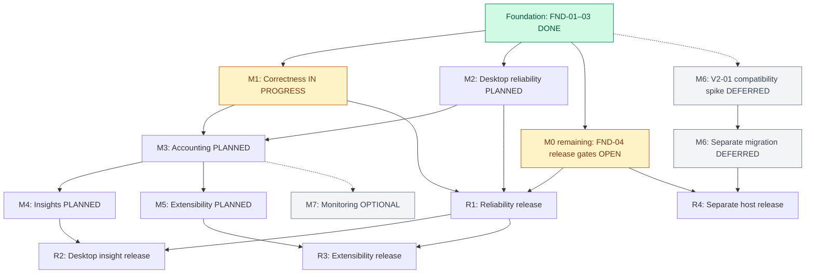
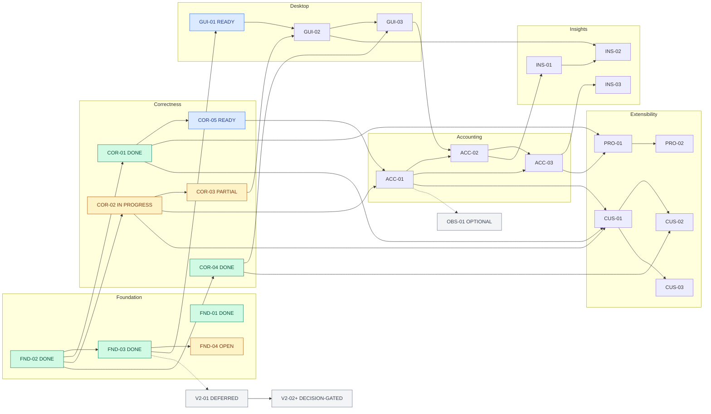

# Upstream adoption roadmap and delivery plan

Prepared: 2026-10-06. Status: execution started. See the live delivery tracker below; milestone completion requires acceptance evidence.

## Live delivery tracker

Updated: 2026-10-06. Parent issue: [Upstream adoption delivery](https://github.com/thanhndv212/opencode-quota/issues/3). PRs #30–#34 are merged on `main`; the latest verified implementation is `220c1c0`. COR-02 is being implemented on `fix/cor-02-account-cache`. Work-item completion and remaining dependencies are shown below.

| Milestone | Status      | Completion gate                                                                          |
| --------- | ----------- | ---------------------------------------------------------------------------------------- |
| M0        | In progress | Tracking/protection, green Linux CI, installed package/GUI smoke, fork release candidate |
| M1        | In progress | Correctness backports and identity/usage/recovery evidence                               |
| M2        | Planned     | Standalone config, scheduling, history and budget evaluation                             |
| M3        | Planned     | Accounting parity and database/export compatibility                                      |
| M4        | Planned     | Verified reset notices and eligible exhaustion estimates                                 |
| M5        | Planned     | Provider contracts and validated custom definitions                                      |
| M6        | Deferred    | Separate OpenCode 2 compatibility decision and migration                                 |
| M7        | Optional    | Validated metrics consumer without additional requests                                   |

### Work-item status

| Item   | GitHub issue                                                   | Status      | Evidence / remaining work                                                                                               |
| ------ | -------------------------------------------------------------- | ----------- | ----------------------------------------------------------------------------------------------------------------------- |
| FND-01 | [#4](https://github.com/thanhndv212/opencode-quota/issues/4)   | Done        | Tracking/protection verified; PR #30 merged; automation re-enabled; #4 closed                                           |
| FND-02 | [#5](https://github.com/thanhndv212/opencode-quota/issues/5)   | Done        | Main CI 37504881469 green at 79fa935; #5 closed                                                                         |
| FND-03 | [#6](https://github.com/thanhndv212/opencode-quota/issues/6)   | Done        | Main CI: Node 20/22 tarball + Linux/macOS Electron checks passed; #6 closed                                             |
| FND-04 | [#7](https://github.com/thanhndv212/opencode-quota/issues/7)   | In progress | PR #33: Linux/macOS unsigned candidates built in run 37505462379; draft/tag and npm authentication/registration pending |
| COR-01 | [#8](https://github.com/thanhndv212/opencode-quota/issues/8)   | Done        | PR #32 merged after six CI checks; whole-response deadline verified on real HTTP fixtures                               |
| COR-02 | [#9](https://github.com/thanhndv212/opencode-quota/issues/9)   | In progress | Shared-cache identity contract and DeepSeek adapter implemented; other providers and outer toast caches pending         |
| COR-03 | [#10](https://github.com/thanhndv212/opencode-quota/issues/10) | In progress | PR #34: recovery and availability/desktop regressions pass; 429 cooldown evidence remains                               |
| COR-04 | [#11](https://github.com/thanhndv212/opencode-quota/issues/11) | Done        | PR #31 merged after all six CI checks; source/sync/multiplicity fixtures passed                                         |
| COR-05 | [#12](https://github.com/thanhndv212/opencode-quota/issues/12) | Planned     | Legacy/current payload contracts                                                                                        |
| GUI-01 | [#13](https://github.com/thanhndv212/opencode-quota/issues/13) | Planned     | Config parity scenarios                                                                                                 |
| GUI-02 | [#14](https://github.com/thanhndv212/opencode-quota/issues/14) | Planned     | Clock + packaged app evidence                                                                                           |
| GUI-03 | [#15](https://github.com/thanhndv212/opencode-quota/issues/15) | Planned     | Persistence + alert-window tests                                                                                        |
| ACC-01 | [#16](https://github.com/thanhndv212/opencode-quota/issues/16) | Planned     | Semantic row contract tests                                                                                             |
| ACC-02 | [#17](https://github.com/thanhndv212/opencode-quota/issues/17) | Planned     | Migration/rollback fixtures                                                                                             |
| ACC-03 | [#18](https://github.com/thanhndv212/opencode-quota/issues/18) | Planned     | Shared data parity and UI evidence                                                                                      |
| INS-01 | [#19](https://github.com/thanhndv212/opencode-quota/issues/19) | Planned     | Concurrent/restart deduplication                                                                                        |
| INS-02 | [#20](https://github.com/thanhndv212/opencode-quota/issues/20) | Planned     | OS + channel-policy evidence                                                                                            |
| INS-03 | [#21](https://github.com/thanhndv212/opencode-quota/issues/21) | Planned     | Independent calculation fixtures                                                                                        |
| PRO-01 | [#22](https://github.com/thanhndv212/opencode-quota/issues/22) | Planned     | Auth/parser/surface contract                                                                                            |
| PRO-02 | [#23](https://github.com/thanhndv212/opencode-quota/issues/23) | Planned     | Per-provider evidence checklist                                                                                         |
| CUS-01 | [#24](https://github.com/thanhndv212/opencode-quota/issues/24) | Planned     | Schema + mapping + request tests                                                                                        |
| CUS-02 | [#25](https://github.com/thanhndv212/opencode-quota/issues/25) | Planned     | Idempotent counters/pricing tests                                                                                       |
| CUS-03 | [#26](https://github.com/thanhndv212/opencode-quota/issues/26) | Planned     | JSONC diff/write/rollback tests                                                                                         |
| OBS-01 | [#27](https://github.com/thanhndv212/opencode-quota/issues/27) | Optional    | No-request/no-exporter tests                                                                                            |
| V2-01  | [#28](https://github.com/thanhndv212/opencode-quota/issues/28) | Deferred    | Compatibility decision record                                                                                           |
| V2-02+ | [#29](https://github.com/thanhndv212/opencode-quota/issues/29) | Deferred    | Host matrix + migration evidence                                                                                        |

Milestones are closed on GitHub and marked Done here only when every required item passes its acceptance gate. A merged PR without remaining platform/registry evidence does not complete the milestone.

### Execution evidence

- Baseline Linux/Node 22 reproduced 1 failed test file / 2 failed tests: `dashboard.sqljs-database.test.ts` could not load the optional native SQLite binding. Pinned pnpm 10.0.0 ignored the newer `allowBuilds` setting; `onlyBuiltDependencies` is now explicit.
- Installed tarball smoke passes on local Node 26.4.0; runtime Node 20/22 CI is pending.
- Real macOS Electron 42.5.0 smoke passes from an isolated installed tarball: preload API, six tabs, version, manual refresh, hidden-window tray refresh, quit. Provider IPC is fixture-backed; this does not establish live provider correctness or DMG installation.
- Local suite baseline after initial foundation changes: 129 files / 1,276 tests passed. Final PR checks supersede this intermediate result.
- Installed OpenCode reports 1.18.10; actual host command validation remains unverified.

## 1. Outcome and approach

Deliver a reliable desktop quota monitor and OpenCode plugin that adopts useful upstream improvements while preserving this fork's Electron application, quota history, Claude Code usage ingestion, encrypted key management, custom pricing, and token synchronization.

Use selective, dependency-aware backports for the existing compatibility line. Treat OpenCode 2 as a separate migration with its own compatibility decision and release. Do not merge upstream main wholesale: the two repositories differ in host APIs, authentication, storage, packaging, and product scope.

The proposed order is:

1. Establish green Linux CI, reproducible packages, and a fork-owned release workflow.
2. Fix incorrect accounting, incomplete HTTP timeouts, and account-unsafe caching.
3. Make standalone desktop configuration, refreshing, and history recording reliable.
4. Introduce structured accounting while preserving existing export and database contracts.
5. Deliver reset notifications and fixed-window exhaustion estimates.
6. Add selected providers and configurable custom providers.
7. Add monitoring only where useful; evaluate OpenCode 2 independently.

The default assumption is continued support for the current OpenCode integration first. The exact supported OpenCode 1 version must be measured and pinned in milestone M0; the dependency range in package.json is not sufficient evidence of host compatibility. If OpenCode 2 is the immediate product requirement, move the M6 compatibility spike into M0 and revise the sequence before investing in host-specific backports.

## 2. Verified baseline and evidence limits

| Item                            | Observed baseline                                                                                                                            |
| ------------------------------- | -------------------------------------------------------------------------------------------------------------------------------------------- |
| Fork                            | `thanhndv212/opencode-quota`, default branch `main`                                                                                          |
| Local reviewed commit           | `b598c15bf8e18a35f869fd1387aa51ef7e03baab`, package version `3.10.1`                                                                         |
| Upstream main                   | `360b0c509db5e030ff27d4bbf324cb5c6198b83f`, version `5.0.1`                                                                                  |
| Upstream OpenCode 1 line        | `upstream/release/4.x` at `5e20e58b3e516996cde7725601fc62e945025df1`, version `4.10.7`                                                       |
| Common ancestor                 | `998fdfec691a8254dd32f8817f99da97ad7c8c06`                                                                                                   |
| Divergence from main            | 56 fork-only and 509 upstream-only commits by ancestry; this does not imply 509 independent features or 56 independent patches               |
| Local checks from investigation | Typecheck passed; 129 test files / 1,276 tests passed; TypeScript build passed                                                               |
| Local package gate              | `pnpm run build:check` fails because pinned pnpm 10.0.0 rejects `pnpm pack --dry-run`                                                        |
| Current GitHub CI               | Latest CI run for the reviewed commit failed in `pnpm-quality` at Test; runtime-smoke skipped. Logs return HTTP 410, so the cause is unknown |
| GitHub issue tracking           | Issues disabled; no open PRs returned                                                                                                        |
| Protection                      | Main branch protection API reports unprotected; repository rulesets query returns none                                                       |
| Current CI coverage             | Linux quality job, package tarball, Node 20/22 consumer smoke; no Electron interaction gate                                                  |
| Current release workflow        | Publishes the inherited `@slkiser/opencode-quota` name; adjusts version during publishing and pushes a version-sync commit afterward         |
| Desktop gaps                    | Quota config loader returns defaults; refresh interval is unused; standard build omits renderer assets; source fallback path is incorrect    |

The local investigation did not establish live provider correctness, packaged Electron behavior, supported OpenCode versions, signing/notarization readiness, or npm publishing rights. Mark these as unverified until their gates run. No provider credentials or personal usage databases are needed for ordinary CI.

Sources: [fork CI run](https://github.com/thanhndv212/opencode-quota/actions/runs/28853466877), [upstream main at reviewed commit](https://github.com/slkiser/opencode-quota/tree/360b0c509db5e030ff27d4bbf324cb5c6198b83f), [upstream 4.x at reviewed commit](https://github.com/slkiser/opencode-quota/tree/5e20e58b3e516996cde7725601fc62e945025df1). Local implementation references below refer to the reviewed fork and may move during delivery.

## 3. Product contracts that every phase must preserve

### Command and network boundaries

- Quota and token reports remain deterministic. No LLM/model request may be caused by report calculation or display.
- On the existing host line, server commands use `buildQuotaDialogCommandOutput()`, ignored/no-reply injection, and the handled boundary. TUI dialogs never call `session.prompt()`.
- Provider requests are quota/usage requests only. New estimates, notifications, metrics, and history recording reuse fetched results.
- An explicit refresh may bypass the result cache, but must not silently bypass provider rate-limit cooldowns or cause an unbounded retry loop.
- Preserve no-extra-request behavior for cache-only status-bar/threshold integrations; introduce any live CLI fetch mode explicitly with tests and docs.

### Data correctness

- Distinguish observed provider usage, local estimates, unknown values, stale values, and errors.
- Preserve account, provider, window, source, currency, and unit identity through cache, UI, exports, and history.
- Never sum incompatible units or different currencies into one total. Do not turn missing limits into unlimited quota or zero usage.
- Copied fork-session messages count once; genuine identical-looking messages remain distinct. Claude Code and OpenCode source records must not collapse merely because timestamps/text match.
- Existing historical data must remain readable. Account identity cannot be retroactively invented for legacy records; label it unknown and exclude it from account-specific comparisons.
- Raw credentials never enter diagnostics, cache filenames, export files, notification state, screenshots, or CI artifacts.

### Fork features

Keep Electron Dashboard, Tokens, Alerts, Pricing, API Keys, and History working. Preserve Claude CLI discovery/PATH fixes, re-auth messaging, forced refresh, custom pricing, encrypted-store unlock/lock behavior, and existing token-sync formats unless an explicit migration is delivered.

Do not promise downstream GUI support merely because a feature works in the upstream TUI. Each surface needs separate integration and evidence.

## 4. Dependency map and release slices

The implementation foundation is complete: FND-01, FND-02, and FND-03. M0 remains open because FND-04 still needs release/publisher and host/installation evidence. That release gate does **not** block correctness or desktop implementation.

### Milestone and release dependencies



Solid arrows represent prerequisite completion for the milestone or release gate. Dashed arrows identify optional/deferred workstreams. Milestone gates summarize integration and release readiness; individual tasks may start earlier according to the work-item map below. M6 and M7 are not prerequisites for R1–R3. R2 and R3 build on the R1 baseline, but their implementation can overlap once the required contracts are stable.

### Work-item dependency map

This map follows the issue-backlog dependency table. Green nodes are completed; amber nodes are partially delivered/open; blue nodes have all implementation prerequisites completed and can start now. Remaining nodes wait for their listed prerequisites. V2-01 is technically unblocked but remains a deferred product decision.



### Current delivery order

| Lane                      | Next work                                        | Dependency / exit gate                                                                                                                                       |
| ------------------------- | ------------------------------------------------ | ------------------------------------------------------------------------------------------------------------------------------------------------------------ |
| Correctness / identity    | COR-02 (#9), then finish COR-03 (#10)            | Account-safe cache integration plus remaining 429 cooldown evidence; PR #34 already delivered shared-cache recovery and failure diagnostics                  |
| Provider payloads         | COR-05 (#12)                                     | COR-01 is done; legacy/current payload contracts remain to be verified                                                                                       |
| Desktop configuration     | GUI-01 (#13)                                     | FND-03 is done; proceed with effective standalone settings and config parity                                                                                 |
| Desktop refresh / history | GUI-02 (#14), then GUI-03 (#15)                  | GUI-02 needs GUI-01 + completed COR-03; GUI-03 also needs COR-04, already done                                                                               |
| Accounting                | ACC-01 (#16), then ACC-02 (#17) and ACC-03 (#18) | ACC-01 needs COR-02 + COR-05; ACC-02 also needs GUI-03                                                                                                       |
| Release preparation       | Finish FND-04 (#7) alongside implementation      | Version/tag-aligned draft, npm authentication/publisher setup, and remaining host/installation evidence; unsigned artifact builds/checksums already verified |

COR-02 is in progress; COR-05 and GUI-01 remain independently ready. Shared-file PRs still merge in order and rerun required checks against the current base. COR-03's completed portions do not close its remaining gate. Milestone numbering identifies workstreams; a milestone is marked done only when all its acceptance gates pass.

| Release slice        | Included scope                             | Exit condition                                                                                      |
| -------------------- | ------------------------------------------ | --------------------------------------------------------------------------------------------------- |
| R1 reliability       | M0 + M1 + M2                               | Clean CI, consumable tarball, desktop smoke, correct config/refresh/history behavior, retained data |
| R2 desktop insight   | M3 + M4                                    | Rich rows, account-safe history, verified reset notices, bounded fixed-window estimates             |
| R3 extensibility     | M5 selected providers + custom definitions | Provider contract suite, setup docs, GUI parity, upgrade/rollback test                              |
| R4 host migration    | M6, separately versioned                   | Explicit OpenCode 2 support, migration/rollback evidence, all fork surfaces retained                |
| Optional patch/minor | M7                                         | Useful monitoring deployment with no extra provider requests                                        |

Exact versions depend on the fork's package/distribution identity decision. Do not reuse upstream version numbers to imply parity. Compatibility-breaking config, package name, runtime, or storage changes require explicit release notes and an appropriate major-version decision.

## 5. M0 — Delivery foundation and reproducible baseline

**Goal:** Make future changes reviewable and releasable from a known green baseline. Estimated engineering effort: 3–5 person-days.

### M0.1: GitHub tracking and repository policy

Enable issues in the fork when implementation begins. Create the milestones and labels in section 13, then create a parent roadmap issue linking this document and child issues. Modify the stale workflow to exempt `roadmap`, `epic`, and `blocked` work; otherwise the existing 23-day stale / 7-day closure policy will close planned delivery items. Check malformed-issue automation against the new issue template before bulk creation.

Protect main with required PRs, unique CI check names, resolved review conversations, and disabled force pushes/deletion. Apply controls to maintainers where supported. Require an independent approving reviewer when one is available; for a solo-maintainer repository, use documented maintainer review plus mandatory checks rather than an impossible self-approval requirement. Do not make a nonexistent check required before it has run once.

**Acceptance:** issues usable; a sample issue follows automation rules; required checks appear on a draft PR; a failing test prevents merge; roadmap issues survive a dry-run policy review. Repository-setting changes are implementation work, not performed by this plan.

### M0.2: Reproduce and repair CI

Re-run a fresh Linux job for the reviewed commit in isolated config/data/state directories. Record Node, pnpm, OS, native SQLite availability, and dependency versions. Investigate the failed test step before changing assertions. Possible platform differences are hypotheses, not the diagnosed cause.

Resolve noisy dashboard mocks that omit runtime-directory helpers when they hide untested code paths. Keep intentional error-path assertions; remove unexplained warnings. Build before tests because existing TUI tests inspect the distribution payload.

**Acceptance:** the existing suite passes on fresh Linux CI and locally; failures are explained; runtime-smoke jobs actually execute. Do not report skipped jobs as validation.

### M0.3: Package and Electron foundation

Fix `build:check` to create a real tarball in a temporary/artifact directory and smoke that artifact; remove reliance on unsupported dry-run flags. Decide and document that the normal npm build includes renderer assets because the package advertises a GUI entry point. Keep the dependency order: clean, TypeScript, data/TUI preparation, renderer copy, package verification.

Correct development renderer and package-version paths. Add an installed-package test that runs without the source checkout, confirms renderer/CSS/JS/preload/data/schema files exist, and launches the actual Electron window with fixture IPC. Add a clean-build case so previously copied dist assets cannot conceal missing build steps.

Reconcile setup docs with pinned tooling: AGENTS.md and CONTRIBUTING.md disagree about pnpm's Node requirement. Establish supported development/runtime combinations by actual CI installation and package smoke, then align docs rather than repeating either claim unverified.

**Acceptance:** standard clean build produces usable GUI assets; packed consumer imports server/TUI correctly; Electron preload exposes quotaApi; Dashboard renders; no renderer console error; version is correct. A source-tree fallback must not be required for installed consumers.

### M0.4: Fork-owned release identity

Choose a package name under a registry scope the maintainer controls, or explicitly choose GitHub desktop/tarball distribution without npm publication. Verify the intended name and registry permissions before publishing. Update self-references, generated TUI imports, installer specs, smoke tests, docs, repository URLs, and updater targets together if renaming.

Replace automatic version editing/pushing during release with a version PR committed before tagging. Build/test/pack once and publish the verified tarball. Separate desktop release assets from npm publication. Add a release environment/manual dispatch decision where useful; deployment approval does not substitute for passing tests.

**Acceptance:** a draft release contains test artifacts and checksums; its package metadata points to this fork; tag/version/commit agree; a desktop prerelease cannot accidentally publish under the upstream npm name; releasing never pushes a new commit to protected main.

## 6. M1 — Correctness and reliability backports

**Goal:** Fix misleading totals, request hangs, and cross-account cache reuse before adding more displays. Estimated effort: 5–8 person-days.

| Work item                         | Implementation scope                                                                                                                                                | Required behavioral tests                                                                                                                                          |
| --------------------------------- | ------------------------------------------------------------------------------------------------------------------------------------------------------------------- | ------------------------------------------------------------------------------------------------------------------------------------------------------------------ |
| M1.1 End-to-end HTTP timeout      | Adapt upstream timeout wrapper to encompass body consumption; migrate provider call sites and pricing fetches; preserve external abort semantics and typed errors   | Delayed headers, stalled body, slow chunks, malformed JSON, caller abort, timeout cleanup, no orphan request; bounded provider aggregation                         |
| M1.2 Account-aware cache          | Resolve identity from the credential actually selected, not only env vars; include it in memory, disk, and in-flight keys; version/invalidate ambiguous old entries | A/B env accounts, global-auth fallback, OAuth login switch, token rotation, concurrent processes, bypass during pending request, no credential in serialized state |
| M1.3 Error-result caching         | Do not persist an error-only result as a healthy snapshot; define partial-result and last-known-good behavior explicitly                                            | Failed fetch then recovery; partial success; stale display labeled; 429 cooldown honored; availability exceptions visible rather than silently discarded           |
| M1.4 Forked-session deduplication | Adapt the 4.x storage fix and preserve Claude Code ingestion, sessions/project aggregation and sync deduplication                                                   | Parent/fork copy, nested fork, true repeated messages, missing origin metadata, multiple machines, same IDs in different sources, range-boundary totals            |
| M1.5 Provider correctness         | Bring Copilot AI Credits/over-limit fixes plus applicable OpenAI duration and Anthropic cooldown fixes                                                              | Legacy/new payloads, missing billing authorization, individual/business limits, >100% consumption, unknown remaining, 429/401, re-auth then refresh                |

For account identity, inspect the complete upstream follow-up chain. The early env-only fingerprint patch is not sufficient by itself. Hash a stable account/credential identity with a documented policy; avoid retaining raw keys and avoid serving an old-account result while identity is unresolved. An identity failure should lead to an unavailable/uncached result, not a shared generic cache bucket.

For HTTP timeout testing, use a local controllable HTTP server in addition to fetch mocks to demonstrate that the body really stops. Use fake clocks for state transitions, not for an assertion that merely repeats the implementation formula.

**M1 exit:** all boundary tests pass; source totals and account selection are correct in shared fixture scenarios; GUI and CLI show recovery/errors accurately; imported fixes have regression tests and provenance entries.

## 7. M2 — Reliable standalone desktop operation

**Goal:** Ensure upstream features have a correct desktop runtime to plug into. Estimated effort: 4–7 person-days.

### M2.1 Shared configuration and runtime

Replace `src/gui/main.ts:loadQuotaConfig()` defaults with the shared loader. Define standalone configuration roots explicitly: global configuration is the default; a project root must be selected explicitly rather than inherited accidentally from Finder's working directory. Preserve plugin project-local settings behavior. Provider secrets still come only from trusted sources.

Reuse `quota-runtime-context.ts` or extract a narrow shared runtime adapter instead of duplicating configuration fields in `src/gui/ipc/quota.ts`. Reflect effective settings and provenance in diagnostics. Decide refresh behavior on file changes (explicit reload plus startup is sufficient initially) and test it.

**Acceptance:** configured providers, plan settings, timeout and pricing settings affect GUI results; CLI/plugin parity holds under identical roots; malformed config produces useful diagnostics; no local project secret is consumed.

### M2.2 Refresh controller

Put scheduling in Electron main, not only the renderer, so a hidden window still refreshes. Honor `refreshIntervalMs`, bound accepted values, coalesce concurrent automatic/manual requests, handle suspend/resume, and dispose timers on quit. Manual refresh can request fresh data; automatic refresh respects TTL/backoff. Update the renderer through a scoped event with an unsubscribe path.

Expose last successful fetch time, fetching state, and stale/error state. Avoid replacing a useful last-known-good result with an unexplained empty page. Do not retry continuously when offline or when auth expires.

**Acceptance:** fake-clock scheduling tests plus a packaged-app smoke cover startup, timer refresh, tray refresh, hidden window, wake-up, overlap, failure/recovery, interval change, and clean exit. Assert fetch counts, not arbitrary performance percentages.

### M2.3 Desktop history and alert plumbing

GUI quota fetching currently does not call the snapshot bridge. Record successful refresh outcomes through one shared post-fetch hook, including actionable error snapshots. Ensure plugin and GUI observing the same result do not double-record one observation. Persistence failure must not prevent quota display.

Review existing snapshot/reset tables before adding identity: plan the M3 additive schema migration here. Keep history based on observed results; do not manufacture historical values from current quota.

Wire budget evaluation to freshly aggregated usage in main and update the renderer/tray state. The preload currently exposes alert evaluation but the renderer does not invoke it. Keep budget threshold evaluation separate from quota reset notices and never compare a daily rule against an all-time aggregate.

**Acceptance:** standalone desktop use creates history without an OpenCode toast; restarting preserves it; duplicate observations are controlled; daily/weekly/monthly alert windows use correct totals; data-read errors show unknown status; quitting and unavailable tray behavior are verified.

## 8. M3 — Structured accounting, identity, and compatibility

**Goal:** Support richer provider data without breaking existing consumers. Estimated effort: 5–8 person-days.

Implement this as three PRs rather than a formatting rewrite:

1. **M3.1 Contract and adapters:** model balance, spend, quota, quantities and supplementary facts with unit/currency, source authority, freshness, window identity and account identity. Start from upstream accounting modules; adapt to existing `entries.ts` consumers. Keep legacy row projection as a compatibility adapter.
2. **M3.2 Persistence and exports:** introduce versioned/additive storage changes where needed. Leave legacy exports unchanged unless a new schema/version is deliberately introduced. New metadata should not silently alter CI threshold meaning. Keep old history rows readable with unknown account identity. Back up and test database migration using fixture copies.
3. **M3.3 Surfaces:** update desktop grouped cards and details, TUI/sidebar/toasts, CLI and reports from the same projection. Preserve balance-only, unlimited, unknown, and over-limit states. Long labels and narrow windows must remain readable.

Existing reset-history detection uses a 10-percentage-point drop threshold. Do not reuse that threshold as a universal notification policy. M4 should share a tested reset-transition model with history while documenting any retrospective history-specific filtering separately.

**Tests:** mixed rows/currencies; zero/missing limits; unavailable vs zero; historical old/new schemas; two accounts for one provider; percent vs quantity export; wide/narrow display; provider-only error result; both SQLite implementations used by the fork; source-aware token sync. Use fixture data and expected semantic values, not snapshots of implementation internals.

**Acceptance:** old consumers pass unchanged; new detail is visible without corrupting compact display; migration is repeatable and transaction-safe; rollback to R1 is tested against a copied database or explicitly requires restoring its backup. If downgrade cannot be supported, state that before releasing M3.

## 9. M4 — Reset notifications and exhaustion estimates

**Goal:** Deliver the two most visible desktop improvements. Estimated effort: 4–7 person-days.

### M4.1 Reset transition engine

Backport the mature 4.x reset-notification implementation, including hardening after its initial feature commit. Use provider/account/window identity, confirmed passage of reset time, a newer reset boundary and replenished quota. Define rounding tolerances only where the provider's precision justifies them.

Persist deduplication with atomic writes and concurrency control because plugin and GUI can run simultaneously. Record enough delivery state to avoid duplicate delivery across processes without silently consuming an event before any selected delivery channel gets it. Default disabled, with explicit watched windows and a desktop delivery preference.

Test: no change, ordinary consumption, rollover with replenishment, expired cached snapshot, clock jump, missing reset, account switch, corruption/recovery, two processes, app restart, and notification failure. Do not notify from a stale result merely because wall time passed.

### M4.2 Notification delivery

Preserve upstream toast behavior on the existing host; add native Electron notification delivery separately. Respect platform notification permission and user preference. Clicking a desktop notice opens the corresponding provider/window view. Keep history of the reset event independent from whether an OS notification was delivered.

Use an explicit channel policy when GUI and plugin are both active: preferred desktop delivery when configured/available, otherwise plugin toast; deduplicate the same event across selected channels. If implementing multiple deliveries intentionally, expose that setting and test it.

### M4.3 Fixed-window projection

Backport `quotaProjection: "runway"` and its eligibility metadata. Compute a linear average since the fixed window began; explain that it is not a recent-rate prediction. Support only rows with known start, end, usage and full reset semantics. Do not infer eligibility from a label such as Weekly or Monthly.

Show an approximation marker, separate reset time, and either an estimated exhaustion duration or “lasts past reset.” Zero/unknown usage, invalid bounds, rolling windows, balance-only data and unsupported providers produce no estimate. Do not add provider calls or silently add projection to stable JSON exports.

**Acceptance:** eligible fixtures yield independently calculated expected times; unsupported rows never display invented forecasts; desktop, CLI and TUI agree; switching used/remaining display does not alter the estimate; notification permission failure does not break the app. Record macOS and Linux delivery evidence separately.

## 10. M5 — Provider expansion and configurable sources

**Goal:** Expand coverage without creating permanent provider-specific GUI logic. Estimated effort: 5–8 person-days for custom definitions, plus 1–3 days per ordinary provider; Console/OAuth adapters may take longer.

### M5.1 New built-in providers

Start with OpenRouter as the representative key/budget provider. Select subsequent providers by actual usage and availability of a test account. Candidate order: OpenRouter, OpenCode Zen, Kilo, then MiMo/xAI/Alibaba Token Plan as needed. This is a value-based default, not evidence that the user subscribes to any of them.

For each provider, inspect its implementation at the pinned 4.x revision and all later fixes touching that adapter. Do not backport obsolete Zen billing-page scraping when current upstream uses Console integration. Treat CLI-dependent adapters as a separate integration with executable discovery, bounded execution and fixture tests.

Each issue must include:

- Supported auth paths and precedence, with a passing test for every advertised path.
- Current endpoint/response contract and sanitized success/error fixtures.
- Correct units, reset semantics, empty/unlimited/over-limit states and partial data behavior.
- Account identity for cache/history; provider registration and metadata/docs changes.
- Desktop, CLI and plugin rendering evidence using identical data.
- Live read-only quota validation when an account is available; otherwise explicit fixture-only status and no claim of live validation.

Do not automatically remove this fork's Qwen or Antigravity adapters just because upstream 4.x/main removed them. Evaluate whether they still work, document unsupported cases, and make removal a separate compatibility decision.

### M5.2 Custom provider schema and engine

Adopt global-only `quotaProviders` definitions with upstream's bounded, declarative response mapping. Stage remote `quota-v1`/`json-v1` support first, then local estimates and guided editing.

Remote definitions use authenticated GET requests and explicit response-path mappings. Keep credentials in env or trusted auth/config sources. Reject executable expressions, arbitrary scripts, unsupported methods/headers and unbounded mappings. Validate URL/redirect behavior so credentials cannot be forwarded to an unintended host. Sanitize diagnostics instead of logging raw response bodies.

Local estimates need stable completion/event identity, source-aware counters, restart-safe persistence, time-window boundaries, and pricing coverage. If pricing is incomplete, retain request counts and mark budget percentages unavailable. Do not count a retried/streamed completion multiple times.

### M5.3 Guided setup and maintenance

Add `provider add` with validation, a complete config diff preview and an explicit write step. Preserve JSONC comments, unrelated settings, file permissions and symlink semantics. Initially reuse this CLI from documented desktop setup instructions; a full GUI provider editor is a separate optional feature.

Add terminal `status` if the selected upstream implementation materially improves diagnosis. Keep the proposed safe updater deferred until it targets the fork's chosen distribution identity; an updater must never replace the fork with upstream by default.

**Acceptance:** two fixture-backed custom endpoints with different mappings work across surfaces; invalid mappings and untrusted config fail safely; local counters survive restart without inflation; config round-trip preserves unrelated content; built-in and custom providers share presentation logic.

## 11. M6 — OpenCode 2 migration, separate decision and release

**Goal:** Adopt new host capabilities without mixing a compatibility break into routine backports. Initial spike: 2–3 person-days; full migration planning allowance: 10–15 additional person-days.

The reviewed upstream main targets OpenCode 2.0.16+ and Node 22.13+ or 23.4+, uses new plugin APIs/authentication and moves quota computation to a server RPC. Its CLI can read saved logins without a running OpenCode instance. Reconfirm the exact supported matrix at implementation time.

Spike deliverables:

1. A compatibility decision record comparing continued legacy support, a separate legacy maintenance branch, and a new default OpenCode 2 line.
2. One end-to-end fixture/provider vertical slice: service authentication → quota → CLI/TUI → standalone desktop.
3. A list of fork modules affected by auth, config roots, SQLite, TUI package/output and server commands.
4. Evidence that the GUI can still operate without a running OpenCode session/service, including defined behavior when saved credentials are absent.
5. A migration/rollback prototype using copied fixture configurations and databases.

Full migration PRs should separately cover host adapter, credential/config resolution, usage storage, command surfaces, and desktop compatibility. Re-express the no-model-call invariant against the new command/RPC contract; do not mechanically preserve the old handled sentinel where the new API supplies a different mechanism.

Consider upstream retry-after-reset only after migration. It changes session execution timing rather than report display. Test matching the actual failing provider/window, fresh quota checks, permission/transport errors that must not wait, no valid reset, bounded wait, cancellation, resume and multiple limits. Start opt-in for this fork and document the behavior before considering a default change.

**Exit:** supported host/runtime matrix passes; migrated and fresh installs both work; legacy fallback/removal policy is explicit; all six Electron tabs and Claude Code ingestion still work; downgrade instructions have been exercised; major-release notes cover removals and re-login requirements.

## 12. M7 — Optional monitoring and maintenance tools

Estimated effort: 1–2 person-days for metrics, excluding infrastructure setup.

Adopt passive OpenTelemetry consumed/cache-age gauges only if there is a target consumer. Use the host's registered meter/exporter; do not create a background exporter, new credential path or refresh loop by default. Keep metric labels bounded and free of user paths, account labels, tokens and raw URLs. Test no-op behavior without a meter, cache-only collection, stale values, over-limit normalization and exporter failure isolation.

Maintain a weekly upstream review issue/report after core delivery. The existing `upstream:sync` tooling tracks companion plugins; it is not a merge mechanism for `slkiser/opencode-quota`. Add a separate upstream-application review task with a pinned comparison range and a ledger. Group fixes, features, removals, runtime changes and provider endpoint changes. Never auto-merge feature batches.

## 13. GitHub execution workflow

### Tracking structure

Use one parent issue for this roadmap, one milestone per M0–M5 release workstream, and separate deferred milestones for M6/M7. A GitHub Project is optional; milestones and labels are sufficient for a solo maintainer.

Recommended Project fields if used: Status, Priority, Milestone, Component, Upstream SHA, Dependencies, Effort, Evidence URL, Target release. Statuses: Backlog → Ready → In progress → In review → Validating → Done, with Blocked as an explicit side state and blocker reason.

Labels: `roadmap`, `epic`, `upstream-backport`, `fork-integration`, `bug`, `feature`, `testing`, `release`, `compatibility`, `blocked`; priorities `priority:p0/p1/p2`; components `area:core`, `area:gui`, `area:providers`, `area:storage`, `area:ci`. Use built-in bug/feature labels if equivalents already exist.

Owner: maintainer/product owner chooses scope and compatibility. Implementer owns code and regression evidence. Reviewer verifies behavior/provenance. Release owner verifies artifacts and rollout. One person may hold multiple roles, but an independent reviewer is preferred for auth/cache/storage changes when available.

### Issue backlog and PR sequence

IDs below are stable planning identifiers; the live tracker maps them to actual GitHub issues. Dependencies are work-item completion gates, consistent with the map in section 4. Split a row further if its reviewable diff spans unrelated behavior.

| ID     | Proposed issue / PR title                              | Depends on             | Completion evidence                   |
| ------ | ------------------------------------------------------ | ---------------------- | ------------------------------------- |
| FND-01 | Enable delivery tracking and protect main              | None                   | Settings record, issue/template check |
| FND-02 | Reproduce Linux test failure and restore CI            | None                   | Fresh green run at recorded SHA       |
| FND-03 | Package renderer and smoke installed GUI               | FND-02                 | Tarball consumer + Electron smoke     |
| FND-04 | Establish fork release identity and artifact promotion | FND-03                 | Draft release and metadata checks     |
| COR-01 | Enforce HTTP timeout through body reads                | FND-02                 | Controllable-server regression        |
| COR-02 | Isolate provider caches by resolved account            | FND-02                 | Cross-account/process tests           |
| COR-03 | Recover cleanly from cached provider errors            | COR-02                 | Error/recovery and cooldown tests     |
| COR-04 | Deduplicate copied session usage                       | FND-02                 | Fork/source/sync total fixtures       |
| COR-05 | Update Copilot and quota-window parsing                | COR-01                 | Legacy/current payload contracts      |
| GUI-01 | Load effective standalone quota settings               | FND-03                 | Config parity scenarios               |
| GUI-02 | Schedule/coalesce desktop refreshes                    | GUI-01, COR-03         | Clock + packaged app evidence         |
| GUI-03 | Record standalone history and evaluate budgets         | GUI-02, COR-04         | Persistence + alert-window tests      |
| ACC-01 | Add structured accounting compatibility adapter        | COR-02, COR-05         | Semantic row contract tests           |
| ACC-02 | Persist account/window identity safely                 | ACC-01, GUI-03         | Migration/rollback fixtures           |
| ACC-03 | Render rich accounting across surfaces                 | ACC-01, ACC-02         | Shared data parity and UI evidence    |
| INS-01 | Add durable reset transition detection                 | ACC-02                 | Concurrent/restart deduplication      |
| INS-02 | Deliver desktop and plugin reset notices               | INS-01, GUI-02         | OS + channel-policy evidence          |
| INS-03 | Add eligible fixed-window exhaustion estimates         | ACC-03                 | Independent calculation fixtures      |
| PRO-01 | Add OpenRouter quota and budget support                | ACC-03, COR-01         | Auth/parser/surface contract          |
| PRO-02 | Add chosen additional provider                         | PRO-01                 | Per-provider evidence checklist       |
| CUS-01 | Add validated custom remote definitions                | ACC-01, COR-01, COR-02 | Schema + mapping + request tests      |
| CUS-02 | Add durable local accounting definitions               | CUS-01, COR-04         | Idempotent counters/pricing tests     |
| CUS-03 | Add guided provider configuration                      | CUS-01                 | JSONC diff/write/rollback tests       |
| OBS-01 | Expose passive quota metrics                           | ACC-01                 | No-request/no-exporter tests          |
| V2-01  | Prototype OpenCode 2 vertical slice                    | FND-03                 | Compatibility decision record         |
| V2-02+ | Migrate selected host line in staged PRs               | V2-01 decision         | Host matrix + migration evidence      |

### Issue template

```markdown
Problem / user-visible outcome:
Current behavior and concrete reproduction:
Scope and non-goals:
Upstream repository, full SHAs, relevant follow-up fixes:
Fork-specific integration points:
Dependencies: <planning IDs, replaced with issue links>
Acceptance criteria: <observable behavior>
Test plan: <unit, integration, package, host, desktop as applicable>
Migration / rollback:
Evidence required and known validation limits:
Estimate and owner:
```

### Branch and worktree lifecycle

Use short-lived branches such as `fix/cor-01-http-timeouts` and `feat/ins-02-desktop-reset-notices`. Base independent work on fork main; base dependent work on a parent PR only when necessary and state the stack. Use a separate worktree for each active integration to avoid mixing unrelated changes.

Example commands for implementation, not actions already taken:

```sh
git fetch origin
git fetch upstream --no-tags
git worktree add -b fix/cor-01-http-timeouts ../opencode-quota-cor-01 origin/main
cd ../opencode-quota-cor-01
corepack enable
corepack prepare pnpm@10.0.0 --activate
pnpm install --frozen-lockfile
git show --stat 98b2aedf205bfa278bc894be4e907a4cdea8cc49
git log --oneline upstream/release/4.x -- src/lib/http.ts
```

Before import, inspect the complete patch, parent contracts and follow-ups. Use `git cherry-pick -x <full-sha>` only when the commit fits the fork's APIs and dependency order. For adapted ports, implement against the fork and include `Upstream-Commit:` / `Adapted-From:` provenance in the commit/PR. Do not accept conflicts by choosing an entire upstream file over fork-specific behavior.

Maintain an upstream adoption ledger, initially a table in this file or a tracked root-level `UPSTREAM_ADOPTION.md`: feature, source SHA(s), follow-up SHA(s), method (exact/adapted/deferred), target PR, tests, divergence reason, and last reviewed upstream ref. Use root-level documents until the repository's broad docs ignore rules are deliberately revised.

### Pull request lifecycle

1. Link the issue and open a draft once the concrete scope and upstream sources are known.
2. Add a failing behavioral regression when fixing a bug. Do not add tests that only restate implementation or tests for trivial documentation changes.
3. Implement the smallest coherent slice, including affected GUI adapters and compatibility contracts.
4. Run the applicable local gates and attach concise results with exact versions/SHA. Distinguish mocked, fixture, packaged and live evidence.
5. Mark ready after required CI passes. Reviewer checks correctness, fork preservation, migration, command boundaries and provenance.
6. Resolve review feedback, rerun affected gates, and update the PR description to describe the final result.
7. Merge only after all required checks complete; use a consistent merge policy. Exact upstream commits can use merge commits to retain provenance; adapted work can squash with source trailers retained. If linear history is selected, use squash/rebase consistently instead.
8. Validate the merged commit in main CI before promoting an artifact. Close issues only when their acceptance criteria are met, not just when a partial PR merges.

PR body additions to the existing template: trigger → before/after behavior, upstream SHA(s), fork-specific changes, supported OpenCode version, test evidence, data/config migration, rollback, screenshots for visual behavior, and remaining unverified cases.

Example GitHub commands after issue tracking is enabled and concrete bodies are written:

```sh
gh issue create --repo thanhndv212/opencode-quota \
  --title '[bug]: Enforce timeouts through response body reads' \
  --body-file /tmp/cor-01-issue.md
git push -u origin fix/cor-01-http-timeouts
gh pr create --repo thanhndv212/opencode-quota --base main --draft \
  --title 'fix(http): bound quota response body reads' \
  --body-file /tmp/cor-01-pr.md
gh pr checks <pr-number> --repo thanhndv212/opencode-quota --watch
```

Keep actual multiline bodies in files. Replace placeholders explicitly; never interpolate provider payloads or credentials into shell commands. Publishing issues/PRs, changing repository settings and creating releases are execution steps beyond this planning deliverable.

## 14. Test strategy and CI design

### Local gates

For relevant implementation changes, run from a clean dependency install:

```sh
pnpm run typecheck
pnpm run build
pnpm test
pnpm run build:gui
git diff --check
```

After FND-03, `build` includes required renderer assets and `build:check` performs real package validation. During development run targeted tests first, then the required full gate once before review. Do not repeat broad tests without new changes/failures. Use changed-file Prettier checks instead of reformatting the repository.

Existing command boundary suites remain mandatory for plugin/TUI/provider changes:

```sh
pnpm exec vitest run \
  tests/plugin.command-handled-boundary.test.ts \
  tests/tui-smoke.test.ts \
  tests/command-handled.test.ts \
  tests/plugin.qwen-hook.test.ts \
  tests/quota-provider-boundary.test.ts
```

### Proposed CI jobs

These are planned jobs/scripts, not commands currently available.

| Job                     | Trigger / scope                                     | Evidence and failure meaning                                                                                    |
| ----------------------- | --------------------------------------------------- | --------------------------------------------------------------------------------------------------------------- |
| `quality-linux`         | Every PR and main push; Node 22 + pinned pnpm       | Typecheck, changed-file formatting, build, tests; code/platform regression                                      |
| `package-consumer`      | Every code PR; current Node 20/22 matrix            | Install built tarball outside repo; imports, CLI fixtures, GUI asset resolution; package contract regression    |
| `desktop-smoke-linux`   | GUI/build/core PRs; display server via Xvfb         | Real Electron launch, preload, fixture dashboard, tab navigation, refresh, quit; runtime integration regression |
| `desktop-smoke-macos`   | GUI/build/release PRs and prereleases               | Same core scenarios on macOS; record runner architecture                                                        |
| `storage-compatibility` | Storage/cache/accounting changes                    | Old/new DB fixture migration, rollback contract, optional SQLite paths, source/account isolation                |
| `host-integration`      | Plugin/TUI changes and release candidates           | Exact supported OpenCode host + deterministic command behavior; fixture auth, no model calls                    |
| `release-artifacts`     | Release candidate/manual workflow                   | OS packages, metadata, checksum, install/uninstall smoke, signing status                                        |
| `required-gate`         | Every PR; runs even after dependency failures/skips | Fails if any applicable job failed/cancelled or an applicable job was skipped                                   |

Keep stable uniquely named checks. If heavy jobs use path filtering, the gate must evaluate applicability explicitly; do not leave a required workflow absent and pending forever. Add `merge_group` triggers only if a merge queue is enabled. Prefer ordinary PR checks initially.

Ordinary tests must use temporary XDG config/cache/state/data paths and fixture auth. Block unexpected outbound network in unit tests. Local HTTP integration servers are allowed. Do not redirect HOME globally; inject task-specific runtime directories and only isolate HOME for subprocess tests that cannot otherwise avoid real user state.

Avoid shell commands that invoke real token-sync push behavior in tests. Git operations use disposable repositories and stub remotes. Never run a test against the contributor's actual sync repository, encrypted key store or OpenCode database.

### Desktop behavior matrix

| Scenario                   | Fixture/automated expectation              | Manual release evidence        |
| -------------------------- | ------------------------------------------ | ------------------------------ |
| First launch, no auth      | Clear empty/setup state, no crash          | macOS and Linux fresh profile  |
| Normal multi-window quota  | Correct units/grouping/resets              | Narrow/wide window screenshots |
| Offline/429/expired login  | Stale/unknown/re-auth state; bounded retry | Network recovery once          |
| Refresh while hidden       | One scheduled fetch; renderer catches up   | Tray hide/show and sleep/wake  |
| Tokens/history             | Expected source totals; account isolation  | Old profile upgrade copy       |
| API Keys                   | Unlock/lock and masked display             | No secrets in screenshots/logs |
| Alerts/reset notifications | Correct transition/window/dedup            | Permission denied and allowed  |
| Quit/no tray               | Process exits; fallback remains accessible | Platform-specific behavior     |

### Evidence classification and failure handling

Use `PASS`, `FAIL`, `BLOCKED` (missing external dependency/account), and `NOT_RUN` in release records. A fixture-backed provider with no live account is not “live verified.” A passed compile is not GUI validation. A passed notification API call is not proof an OS banner appeared.

Classify failures as logic, contract/API drift, environment/toolchain, packaging/runtime, data migration, or external credentials/network. Open an issue with a minimal reproduction. Do not relax a correctness assertion just to get CI green. If a test is flaky, assign an owner and fix or narrowly quarantine with an expiration; never quarantine core command, account-isolation or migration tests to release.

Performance evidence is descriptive initially: cold/warm refresh duration, actual provider request counts, cache hit rate, history-query timing, and UI responsiveness on a documented fixture size. Require no duplicate requests and bounded timeouts. Set numeric budgets only after measuring representative data; do not impose an arbitrary percentage improvement target.

## 15. Upstream backport inventory and selection rules

The entries below are starting points, not a ready-to-cherry-pick batch. Resolve short IDs to full SHAs in each issue and inspect all subsequent fixes to the relevant files at the pinned source ref.

| Capability                       | Starting upstream commits                                          | Porting notes                                                                 |
| -------------------------------- | ------------------------------------------------------------------ | ----------------------------------------------------------------------------- |
| HTTP body timeout                | `98b2aed`                                                          | Many provider call sites; adapt to fork's Anthropic changes                   |
| Account cache                    | `0c2da89`, `176f41c`, `3ccd8f5`, `f2abe47`                         | Review full chain/branch ancestry; final resolved-auth behavior is the target |
| Error-only cache                 | `fb14253`                                                          | Coordinate with provider cooldown and stale-state policy                      |
| Session-copy dedup               | `ffdc82e` on 4.x; `ee17665` on main                                | Use appropriate storage contract; preserve fork's multi-source accounting     |
| Copilot credits                  | `5d7d435`, `5c65696`, `84c2a33` on 4.x                             | Cover billing authorization and over-limit display                            |
| OpenAI windows / Claude cooldown | `3e845de`, `c8241fc`                                               | Keep forced refresh and explicit re-auth messaging                            |
| Structured accounting            | `4c83628`, `95bc510`, `e24f825`, `d7aa2a8`, later projection fixes | Introduce adapter before changing all surfaces                                |
| Reset notifications              | `c2dca3c`, `cedee73`, plus later file history                      | Use hardened persisted state and concurrency behavior                         |
| Fixed-window projection          | `08dd8ea`                                                          | Depends on accounting/window metadata; GUI adapter is fork work               |
| OpenRouter                       | `adee036`, later limit/window fixes including `91f9eee`, `9185b19` | Import final behavior, not only initial provider                              |
| Custom providers                 | `8b005bc`, `af3dfaf`, `0d676d3`, `27ae978`, `130d82b`, `f6393b3`   | Large dependency chain; stage contracts/runtime/editor                        |
| Passive metrics                  | `45abf19`, `957459a`, `227d963`, `c723058`                         | Include dependency/runtime packaging fixes                                    |
| Scoped updater                   | `d52791b`                                                          | Deferred until fork release identity and target pinning are resolved          |
| Retry after reset                | `6d5c785`, `d5035f1`                                               | OpenCode 2 track only; intentional behavior change                            |

For each feature, first ask whether equivalent behavior already exists. For example, this fork already has `/tokens_session_all`; adopting a session-tree feature should improve missing scope behavior or correctness, not add a duplicate command. Do not count the same capability twice in release scope.

Compare using Git history and file-level diffs, not version numbers alone. Keep MIT license/attribution and upstream trailers. Defer unrelated Biome/Lefthook/TypeScript upgrades unless needed by an accepted feature; tooling churn should not obscure provider or storage review.

## 16. Release, rollout and rollback

### Candidate preparation

Create a release PR after the slice is complete. It updates fork version, lockfile where applicable, changelog, compatibility matrix, migration instructions and upstream adoption ledger. Tag only the merged tested commit. Pin the upstream revision used in release notes.

Build artifacts from that commit in CI. Preserve commit SHA, Node/pnpm/Electron versions, target OS/architecture, tarball/package SHA-256, test summary and signing/notarization status. Install and test the exact artifact intended for publication. Packaging success does not establish Gatekeeper/notarization success.

Use a release candidate before a stable release. Minimum candidate exercise: fresh install, old-config upgrade, old-history copy, one supported live provider where available, all six GUI tabs, deterministic host commands, hidden-window refresh, notification delivery, and rollback. A proposed two-working-day candidate observation period is a planning allowance, not a substitute for these scenarios.

### Promotion

Publish the verified npm tarball only under the agreed fork name/rights; attach verified desktop binaries and checksums to the matching GitHub release. Avoid rebuilding between candidate verification and promotion. Distinguish optional npm publication from desktop asset publication.

Release notes include user-visible changes, adopted upstream sources, tested OS/host/runtime versions, configuration changes, schema effects, known limitations and downgrade instructions. No release should claim platform/provider coverage that is only inferred from unit tests.

### Rollback

- Code-only regression: revert the offending PR on the maintained branch, run applicable gates and publish a new patch artifact. Do not rewrite published tags.
- Cache migration: version/isolate cache data and recompute; do not restore an account-ambiguous cache to make rollback easier.
- Database migration: prefer additive/read-compatible changes. If not possible, restore a verified pre-upgrade backup and explain the loss of post-upgrade observations. Exercise this on fixture copies first.
- Notification/projection issue: feature switches disable the new behavior while preserving core quota display.
- Provider outage: mark unavailable with actionable diagnostics, preserve identified stale data, and disable the adapter if necessary; do not invent quota numbers.
- OpenCode 2 migration: retain documented legacy release/install path and copied pre-migration configuration until the new line is validated.

Keep prior release artifacts accessible. A rollback drill is part of R1 and every schema/host-major release.

## 17. Capacity, schedule and decision gates

Estimates assume one experienced maintainer, existing dependencies installed, fixture-driven CI, and no prolonged provider/API investigation. They are planning ranges rather than delivery promises. Review effort, platform access and signing setup can add calendar time.

| Workstream              | Engineering allowance             | Decision at exit                                        |
| ----------------------- | --------------------------------- | ------------------------------------------------------- |
| M0 foundation           | 3–5 days                          | Are CI and artifacts reliable enough to build on?       |
| M1 correctness          | 5–8 days                          | Are identity, usage and recovery contracts trustworthy? |
| M2 desktop runtime      | 4–7 days                          | Can standalone desktop ship a reliability release?      |
| M3 accounting/storage   | 5–8 days                          | Are rich data and migration contracts stable?           |
| M4 desktop insights     | 4–7 days                          | Are notices/estimates correct on supported platforms?   |
| M5 custom engine/editor | 5–8 days                          | Can a provider be added without source changes?         |
| M5 provider adapters    | 1–3 days each; complex auth extra | Is each selected provider worth maintaining?            |
| M6 compatibility spike  | 2–3 days                          | Migrate now, defer, or maintain two host lines?         |
| M6 full migration       | 10–15 days after spike            | Is a separate major release ready?                      |
| M7 metrics              | 1–2 days                          | Is there a real consumer and validated exporter?        |

M0–M4 totals 21–35 engineering days, roughly 5–8 calendar weeks for one maintainer including normal review/release overhead. M5 adds 5–8 days plus selected adapters. The full plan including optional migration is a multi-month program, not a single catch-up PR.

Suggested first ten engineering days:

1. Days 1–2: pin host/platform baseline, enable tracking when executing, reproduce Linux failure, decide package identity.
2. Days 3–5: finish build/package/desktop smoke and release draft path; start HTTP and usage regression work once CI is usable.
3. Days 6–8: complete timeout/dedup fixes; implement resolved-account cache and error recovery.
4. Days 9–10: begin desktop shared config/scheduling; review remaining R1 scope and revise estimates from measured progress.

Do not release R1 by day 10 unless all its gates pass. The first ten days are an implementation sequence, not the R1 deadline.

## 18. Definition of done

A work item is done when its observable acceptance criteria pass; relevant unit/integration/package tests run on the target runtime; affected surfaces have evidence; data/config compatibility is documented and tested; provenance and user docs are updated; and the merged commit is green in main CI.

A release slice is done when its exact artifacts have been installed and exercised on declared platforms, upgrade and rollback work, the release record distinguishes live/fixture/unverified coverage, and the maintainer has promoted those artifacts through the fork's intended distribution channel.

The immediate next implementation slice is FND-02 + FND-03, with FND-01/FND-04 governance and distribution decisions alongside it. The first user-visible feature slice after reliability is reset notifications plus eligible exhaustion estimates.

## 19. Reference links

- [Upstream configuration and projection/notification contracts](https://github.com/slkiser/opencode-quota/blob/360b0c509db5e030ff27d4bbf324cb5c6198b83f/docs/readme/configuration.md)
- [Upstream provider registry](https://github.com/slkiser/opencode-quota/blob/360b0c509db5e030ff27d4bbf324cb5c6198b83f/src/providers/registry.ts)
- [Upstream external integrations](https://github.com/slkiser/opencode-quota/blob/360b0c509db5e030ff27d4bbf324cb5c6198b83f/docs/readme/external-integration.md)
- [OpenCode 2 migration overview in upstream README](https://github.com/slkiser/opencode-quota/blob/360b0c509db5e030ff27d4bbf324cb5c6198b83f/README.md)
- [GitHub protected branch behavior](https://docs.github.com/en/repositories/configuring-branches-and-merges-in-your-repository/managing-protected-branches/about-protected-branches)
- [GitHub workflow triggers](https://docs.github.com/en/actions/how-tos/write-workflows/choose-when-workflows-run/trigger-a-workflow)

GitHub controls described here are a proposed project workflow. Check availability and exact check names in this repository during M0. Upstream links are pinned where possible; re-check provider contracts before actual implementation.
